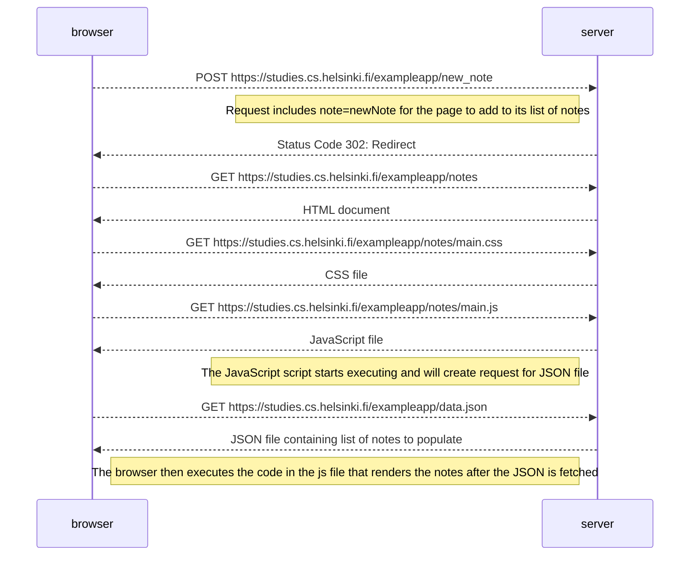

```mermaid
sequenceDiagram
    participant browser
    participant server

browser-->>server: POST https://studies.cs.helsinki.fi/exampleapp/new_note
Note left of server: Request includes note=newNote for the page to add to its list of notes

server-->>browser: Status Code 302: Redirect

browser-->>server: GET https://studies.cs.helsinki.fi/exampleapp/notes

server-->>browser: HTML document

browser-->>server: GET https://studies.cs.helsinki.fi/exampleapp/notes/main.css

server-->>browser: CSS file

browser-->>server: GET https://studies.cs.helsinki.fi/exampleapp/notes/main.js

server-->>browser: JavaScript file

note left of server: The JavaScript script starts executing and will create request for JSON file

browser-->>server: GET https://studies.cs.helsinki.fi/exampleapp/data.json

server-->>browser: JSON file containing list of notes to populate 

note right of browser: The browser then executes the code in the js file that renders the notes after the JSON is fetched


```
