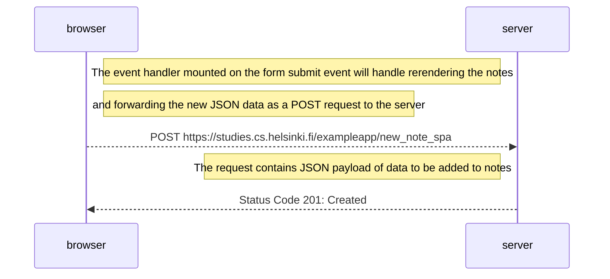

```mermaid
sequenceDiagram

note right of browser: The event handler mounted on the form submit event will handle rerendering the notes 
note right of browser: and forwarding the new JSON data as a POST request to the server

browser-->>server: POST https://studies.cs.helsinki.fi/exampleapp/new_note_spa

note left of server: The request contains JSON payload of data to be added to notes

server-->>browser: Status Code 201: Created


```

